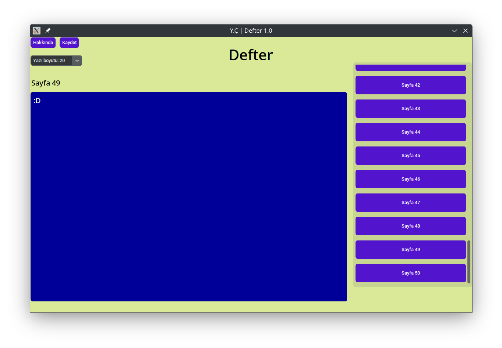

# Defter

Bu bir not defteri programıdır. Sayfalar halinde not tutmanızı sağlar ve sadece Linux işletim sistemi için hazırlanmıştır. yazdığınız notlar Benim geliştirdiğim şifreli bir veri tabaınında tutulur. Bu veri tabanı kullanıcı klasöründe .defter içinde bulunur.
<br>
<p>Kurulum ve daha fazla ayrıntı için <a href="https://defter.netlify.app/">Web sitesini</a> ziyaret edin.<p>
<br>
  

<br>
### Yeni bir kütüphane olan Customtkinter'i kullanır
  
```python
import customtkinter as ctk

window = ctk.CTk()
window.title(baslik_turkce_optimasyon())
window.minsize(1200, 750)
window.maxsize(1200, 750)
window.geometry("1200x750+500+100")  # 'x' yerine '+' kullanılmalı
window.configure(fg_color=main_tema.window)
window.resizable(False, False)

window.mainloop()

```

