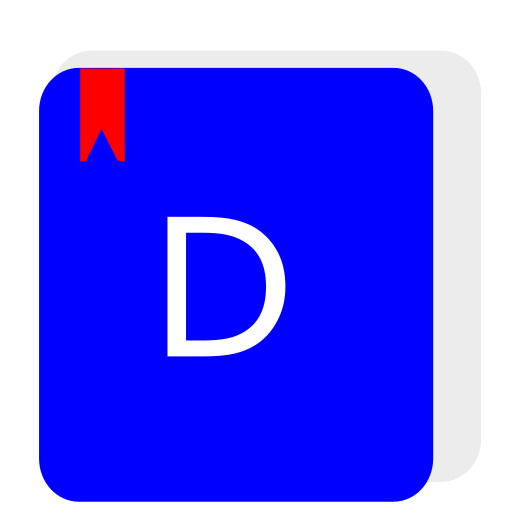

# Defter

<div align="center">



[](https://app.codacy.com/gh/YigitC7/Defter)
</div>

	
  

Bu bir not defteri programıdır. Sayfalar halinde not tutmanızı sağlar ve sadece Linux işletim sistemi için hazırlanmıştır, ama yine de Windows için derlenmiş bir exe versiyonu bulunmaktadır 
<a href="https://github.com/YigitC7/Defter/releases/download/4.0/Defter.exe" title="indir">Windows versiyonu.</a> Yazdığınız notlar Benim geliştirdiğim şifreli bir veri tabaınında tutulur. Bu veri tabanı kullanıcı klasöründe .defter içinde bulunur.

## Kurulum
### Fedora için
```bash	
curl -sSL https://yigit-packages.netlify.app/Defter/install.sh | bash
```
### Pardus / Ubuntu ve diğer Debian tabanlı dağıtımlar için
```bash	
curl -sSL https://yigit-packages.netlify.app/Defter/install.sh | bash
```
curl -sSL https://yigit-packages.netlify.app/Defter/deb/install.sh | bash
### Manuel kurulum
```bash	
git clone https://github.com/YigitC7/Defter
```
```bash
cd Defter
```
```bash
bash ./install.sh
```

>Detaylı kurulum ve daha fazla ayrıntı için <a href="https://defter.netlify.app/">Web sitesini</a> ziyaret edin.

### Yeni bir kütüphane olan Customtkinter kullanır
  
```python
  import customtkinter as ctk

  window = ctk.CTk()
  window.title(baslik_turkce_optimasyon())
  window.minsize(1200, 750)
  window.maxsize(1200, 750)
  window.geometry("1200x750+500+100")
  window.configure(fg_color=main_tema.window)
  window.resizable(False, False)

  window.mainloop()
```
<br>

### Bütün renk kodları düzenli şekilde yazılmıştır

```python
	class colors:
		def __init__(self,
			   sayfalar="#5314CD",
			   genel="#5314CD",
			   window="#d9e997",
			   panel="#c7d492",
			   yazi_panel = "#000099",
			   title_text = "black",
			   info_text = "white",
			   kisa_text = "white",
			   button_text = "white",
			   sayfa_text = "white",
			   yazi_paneli_text = "white",
			   sayfa_numarasi_text = "black",
			   kayit_bildirim_text = "blue",
			   etkin_tema_text = "black"):
			self.sayfalar = sayfalar
			self.genel = genel
			self.window = window
			self.panel = panel
			self.yazi_panel = yazi_panel
			self.title_text = title_text
			self.info_text = info_text
			self.kisa_text = kisa_text
			self.button_text = button_text
			self.sayfa_text = sayfa_text
			self.yazi_paneli_text = yazi_paneli_text
			self.sayfa_numarasi_text = sayfa_numarasi_text
			self.kayit_bildirim_text = kayit_bildirim_text
			self.etkin_tema_text = etkin_tema_text

	tema_index1 = colors()
	tema_index2 = colors(
		sayfalar = "#041538",
		genel = "#363636",
		window = "#1c1c1c",
		panel = "#696969",
		yazi_panel = "#080808",
		title_text = "white",
		sayfa_numarasi_text = "white",
		kayit_bildirim_text = "#6495ed",
		etkin_tema_text = "white",
		yazi_paneli_text = "#dcdcdc"
		)
	tema_index3 = colors(
		sayfalar = "#9C9C9C",
		genel = "#dddddd",
		panel = "#808080",
		yazi_panel = "#2f2f2f",
		window = "#F5F5F5",
		kayit_bildirim_text = "#363636",
		kisa_text = "black",
		info_text = "black",
		sayfa_text = "white",
		button_text = "black",
		)
```

<br>

### Pencere nesneleri x ve y konumları düzenli olarak sınıflandırılmıştır

```python
	class konum:
		def __init__(self,x=1,y=1):
			self.x = x
			self.y = y

	not_paneli_konum = konum(x=600,y=100)
	info_button_konum = konum()
	yazi_paneli_konum = konum(x=1,y=150)
	tema_yaziboyut_secenekleri_konum = konum(x=1,y=50)
	kayit_button_konum = konum(x=235,y=10)
	kisayol_button_konum = konum(x=80,y=1)
	tema_button_konum = konum(x=160,y=1)
	sayfa_numarasi_konum = konum(x=3,y=110)
```
<br>

### Notların tutulduğu dizin içeriği

```
├──.defter\
       ├── end.yigit 
       ├── tema_index.yigit
       ├── texsize.yigit
       └── Notlar\
               ├── sayfa1.yigit
               ├── sayfa2.yigit
               ├── sayfa3.yigit
               ├── sayfa4.yigit
               ├── sayfa5.yigit
               ├── sayfa6.yigit
               ├── sayfa7.yigit
               ├── sayfa8.yigit
               ├── sayfa9.yigit
               ├── sayfa10.yigit
               ├── sayfa11.yigit
               └── sayfa12.yigit

```
```

	end.yigit ──> En son kullanılan sayfa numarası yazar
	tema_index.yigit ──> En son kullanılan tema numarası yazar
	texsize.yigit ──> En son ayarlanan yazı boyutu yazar
	sayfa1.yigit ──> Sayfa içeriği şifreli bir şekilde yazar

```
