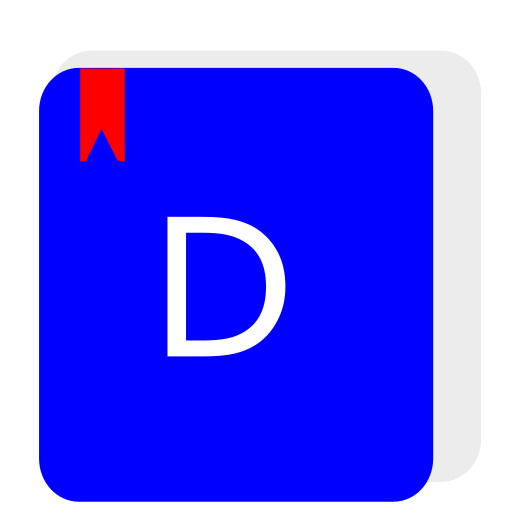

<div align="center">
	
# Defter



[](https://app.codacy.com/gh/YigitC7/Defter)

  <a>
    
  </a>
  
</div>


Bu bir not defteri programıdır. Sayfalar halinde not tutmanızı sağlar ve sadece Linux işletim sistemi için hazırlanmıştır. Yazdığınız notlar Benim geliştirdiğim şifreli bir veri tabaınında tutulur. Bu veri tabanı kullanıcı klasöründe .defter içinde bulunur.

## Kurulum

### İndrme
<a href="https://github.com/YigitC7/Defter/releases/download/6.0/Defter-6.0.deb">DEB pack indir</a>

### Manuel kurulum
```bash	
git clone https://github.com/YigitC7/Defter
cd Defter
python3 -m venv myev
source myev/bin/activate
pip install --upgrade pip
pip install customtkinter pyinstaller
pyinstaller --noconsole --onefile src/Defter.py
sudo mkdir /usr/local/bin/defter
sudo cp -r dist/Defter /usr/local/bin/defter/Defter
sudo cp -r img/icon.png /usr/share/pixmaps/defter.png
sudo cp -r install/Defter.desktop /usr/share/applications/
```
<p>Kaldırmak için</p>

```bash
sudo sh remove.sh
```

<br>

### Notların tutulduğu dizin içeriği

```
├──.defter\
       ├── end.yigit 
       ├── tema_index.yigit
       ├── texsize.yigit
       └── Notlar\
               ├── sayfa1.yigit
               ├── sayfa2.yigit
               ├── sayfa3.yigit
               ├── sayfa4.yigit
               ├── sayfa5.yigit
               ├── sayfa6.yigit
               ├── sayfa7.yigit
               ├── sayfa8.yigit
               ├── sayfa9.yigit
               ├── sayfa10.yigit
               ├── sayfa11.yigit
               └── sayfa12.yigit

```
```

end.yigit ──> En son kullanılan sayfa numarası yazar
tema_index.yigit ──> En son kullanılan tema numarası yazar
texsize.yigit ──> En son ayarlanan yazı boyutu yazar
sayfa1.yigit ──> Sayfa içeriği şifreli bir şekilde yazar

```
<br>

>Daha fazla ayrıntı için <a href="https://defter.netlify.app/">Web sitesini</a> ziyaret edin.
